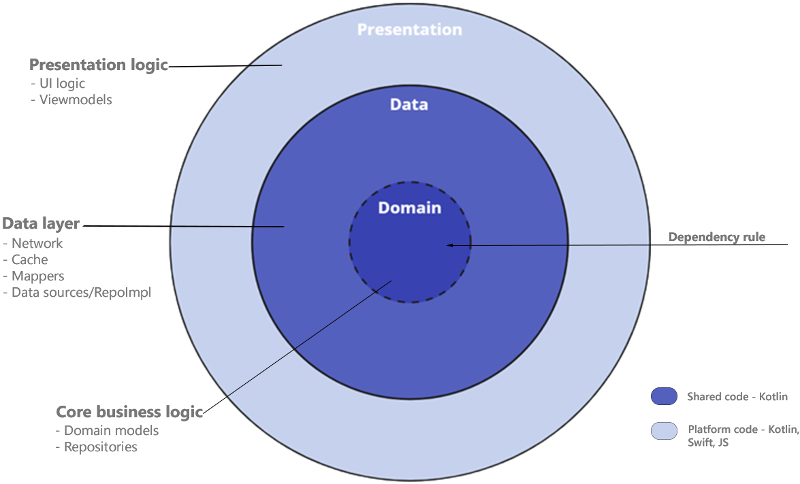
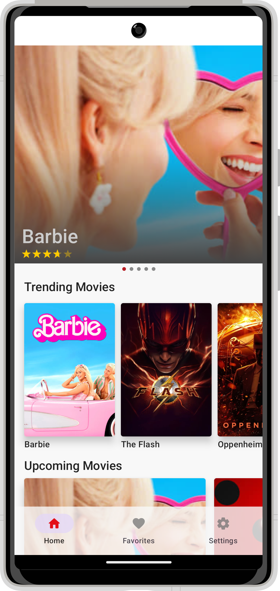
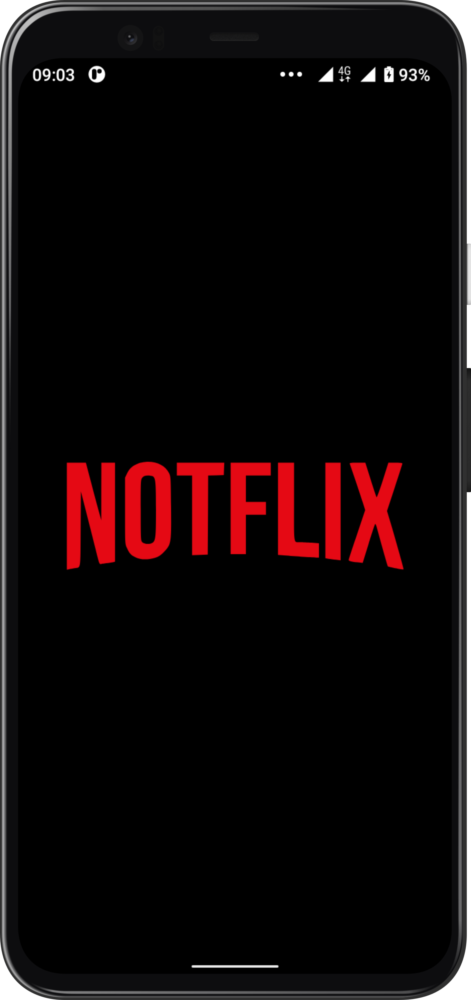
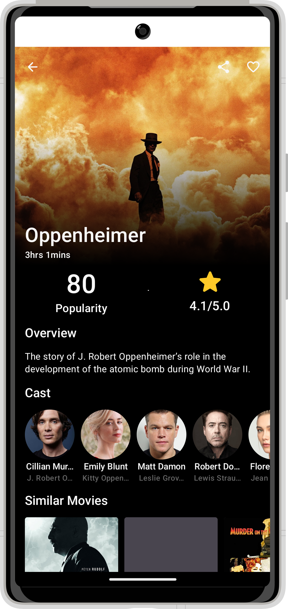
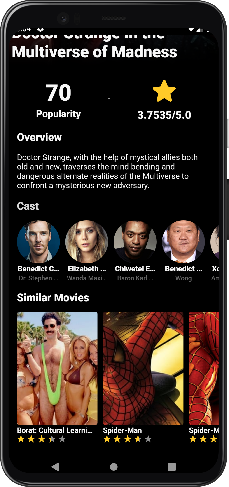
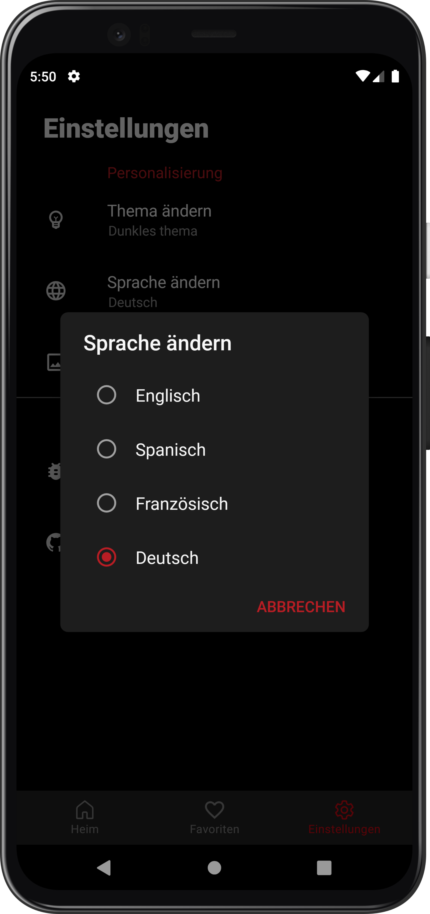
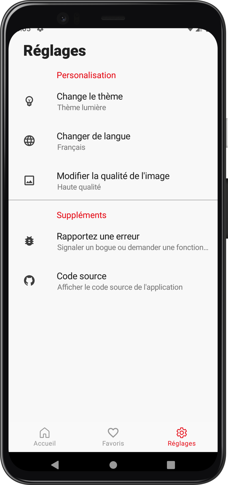
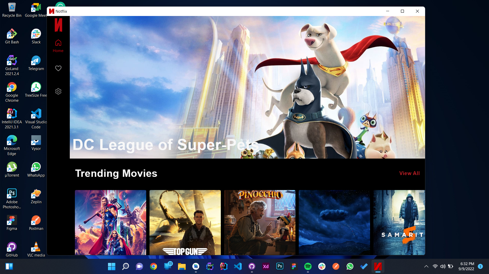
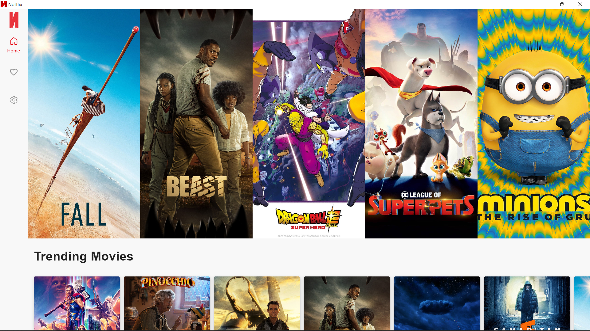
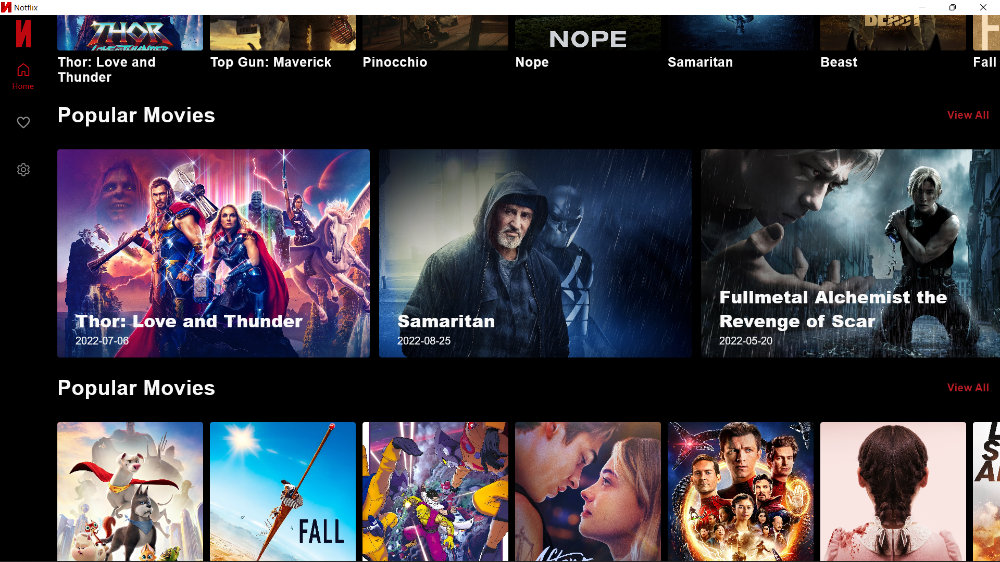

<p align="center"></p>

<p align="center">


</p>

# Notflix

# 🛠️Migrating to KMP - [Develop Branch](https://youtu.be/dQw4w9WgXcQ)

An android and desktop app built using [Kotlin Multiplatforom](https://kotlinlang.org/docs/multiplatform.html) that consumes [TMDB API]("https://developers.themoviedb.org/3") to display current trending, upcoming and popular movies🍿 and tvshows🎬.

[Kotlin Multiplatform](https://kotlinlang.org/docs/multiplatform.html) is a framework of Kotlin that allows for sharing of a single codebase for business logic across different [targets](https://kotlinlang.org/docs/multiplatform-dsl-reference.html#targets)/platforms. Some of the targets supported by kotlin are: Android, iOS, Kotlin/JVM, Kotlin/JS, Android NDK, Windows, Linux, macOS etc.

[Compose Multiplatform](https://www.jetbrains.com/lp/compose-mpp/) is a UI framework mabe by Jetbrains that allow for simple and accelerated desktop application and web development using [compose](https://developer.android.com/jetpack/compose). Compose multiplatform also allows sharing compose UI code between diffrent platforms. eg android, desktop(Windows, Linux, MacOS) and web.

## Table Of Content

- [Prerequisite](##prerequisite)
- [Disclaimer](##disclaimer)
- [Pros of KMP/KMM](##pros-of-kmpkmm)
- [App Structure](##app-structure)
  - [1. androidApp](###1-androidapp)
  - [2. desktopApp](###2-desktopapp)
  - [3. shared](###3-shared)
    - [__Domain__](###domain)
    - [__Data__](###data)
    - [__Presentation__](###presentation)
- [Libraries](##libraries)
  - [Shared](###shared)
  - [Android](###android)
- [Extras](##extras)
- [Demo](##demo)
- [Android App](##android-app)
- [Desktop](##desktop)
- [Related Resources](##related-resources)
  - [Videos 📽️](###videos-️)
  - [Articles/Blogs 📖](###articlesblogs-)
  - [Sample Projects 🤖](###sample-projects-)
- [Other Helpful Resources](##other-helpful-resources)
  - [Videos 📽️](###videos-️-1)
  - [Articles/Blogs 📖](###articlesblogs--1)
  - [Sample Projects 🤖](###sample-projects--1)

## Prerequisite

In order to be able to build the application you'll need to change the api key in [`gradle.properties`](link_to_gradle.properties_file). First and formost you need to generate your own api key by [creating](https://www.themoviedb.org/signup) a TMDB account and [generating](https://www.themoviedb.org/settings/api) an api key.

## Disclaimer

- Koltin Multiplatform is still in alpha phase at the time of writting this however it's still being used by some well known [companies](https://kotlinlang.org/lp/mobile/case-studies/) around the world.

- Kotlin multiplatform and Compose multiplatform are two diffrent concepts that aim to so achieve multiplatform programming. Kotlin multiplatform is all about sharing business logic(at times presentation logic too but only "viewmodels") across diffrent platforms while compose multiplatform is about using/sharing compose UI across diffrent platforms.

- When starting out a KMP/KMM project some knownledge of [Clean Architecture](https://blog.cleancoder.com/uncle-bob/2012/08/13/the-clean-architecture.html) or similar design patterns, SOLID principles, separation of concern and modularization might go a long way into reducing the learning curve. i have discussed the usage of above concepts in a [previous iteration](https://github.com/VictorKabata/Notflix/tree/xml-archive) of this project.

- When using KMP/KMM some knowledge of other programming language such as [Swift](https://developer.apple.com/swift/) or [Javascript](https://kotlinlang.org/docs/js-overview.html) is still required since only the business logic is shared but the UI code is in the native programming language of the targetted platform.
- Kotlin multiplatform and compose multiplatform have limited learning resources and a relatively small community at the time of writting. However learning resources have been attached at the end of this doc and you can find a fast diverse Kotlin community on [Kotlin Official slack](https://kotlinlang.slack.com/messages/kotlin-logging/) or [Android254 twitter](https://twitter.com/254androiddevs?s=20&t=R1PZIGpj8zURaxTzS59yXw).

## Pros of KMP/KMM

- Faster development since you only need to write most of the businness logic and tests only once.
- Improve code quality.
- Highly maintainable and testable code due to separation of concern in the codebase.

## App Structure

<p align="center"></p>

The project currently has 3 main modules:

### 1. [androidApp](https://github.com/VictorKabata/Notflix/tree/main/androidApp)

This module contains the android application's UI built using [Jetpack compose](https://developer.android.com/jetpack/compose).

### 2. [desktopApp](https://github.com/VictorKabata/Notflix/tree/main/desktopApp)

This module contains the desktop application's UI built using [Compose Multiplatform](https://www.jetbrains.com/lp/compose-mpp/).

## 3. [shared](https://github.com/VictorKabata/Notflix/tree/main/shared)

This module contains shared code that holds the domain and data layers and some part of the presentation logic ie.shared viewmodels

### __Domain__

This is the core layer of the application. The ```domain``` layer is independent of any other layers this means that changes in other layers will have no effect on domain layer eg. screen UI (presentation layer) or changing database (data layer) will not result in any code change withing domain layer.

Components of domain layer include:

- __Models__: Defines the core structure of the data that will be used within the application.

- __Repositories__: Interfaces used by the use cases. Implemented in the data layer.

### __Data__

The ```data``` layer is responsibile for selecting the proper data source for the domain layer. It contains the implementations of the repositories declared in the domain layer.

Components of data layer include:

- __Models__

  -__Dto Models__: Defines POJO of network responses.

  -__Entity Models__: Defines the schema of the database.

- __Mappers__: They perform data transformation between ```domain```, ```dto``` and ```entity``` models.

- __Network__: This is responsible for performing network operations eg. defining API endpoints using [Ktor](https://ktor.io/).

- __Cache__: This is responsible for performing caching operations using [Realm](https://github.com/realm/realm-kotlin).

- __Data Sources__:  Responsible for deciding which data source (network or cache) will be used when fetching data and presenting the data to viewmodels.

<p align="center"></p>

### __Presentation__

The `presentation` package contains shared viewmodels code. eg.

```kotlin

```

## Libraries

### Shared

- [Koin](https://insert-koin.io/docs/setup/v3.1) - Kotin dependency injection library with multiplatform support.
- [Ktor](https://ktor.io/docs/http-client-multiplatform.html) - Provides multiplatform libraries required to make network calls to the REST API.
- [Realm](https://github.com/realm/realm-kotlin) - Caching of application data from network responses.
- [Multiplatform Settings](https://github.com/russhwolf/multiplatform-settings) - This is a Kotlin library for Multiplatform apps, so that common code can persist key-value data.
- [kotlinx.coroutines](https://github.com/Kotlin/kotlinx.coroutines) - Library support for Kotlin coroutines with multiplatform support.
- [kotlinx.serialization](https://github.com/Kotlin/kotlinx.serialization) - Provides sets of libraries for various serialization formats eg. JSON, protocol buffers, CBOR etc.
- [kotlinx.datetime](https://github.com/Kotlin/kotlinx-datetime) - A multiplatform Kotlin library for working with date and time.
- [Napier](https://github.com/AAkira/Napier) -  Logger library for Kotlin Multiplatform.
- [Mockk](https://github.com/mockk/mockk) - Library for creating mocks for tests.

### Android

- [Jetpack Compose](https://developer.android.com/jetpack/compose?gclid=Cj0KCQiA95aRBhCsARIsAC2xvfwC4pw6JG3r8U_4zVVSzwfCSIMMM8MKPMGAOTRoMjpkfpimPVz1FwoaAqlUEALw_wcB&gclsrc=aw.ds) - Modern toolkit for building native UI.
- [Coil](https://coil-kt.github.io/coil/) - An image loading library for Android backed by kotlin coroutines.
- [Splash Screen API](https://developer.android.com/guide/topics/ui/splash-screen) - Splash screen API reduces boilerplate code required to create a splash screen.
- [Accompanist Navigation Animation](https://google.github.io/accompanist/navigation-animation/) - Add animation support when navigating between screens using Compose navigation component.
- [Accompanist Pager](https://google.github.io/accompanist/pager/) - A library which provides paging layouts for Jetpack Compose. If you've used Android's ViewPager before, it has similar properties.
- [Accompanist Insets](https://google.github.io/accompanist/insets/)
- [Accompanist System UI Controller](https://google.github.io/accompanist/systemuicontroller/) - A library that provides easy-to-use utilities for updating the System UI bar colors within Jetpack Compose.
- [Accompanist Material Placeholder](https://google.github.io/accompanist/placeholder/) -
- [Accompanist Pager Indicator](https://google.github.io/accompanist/api/pager-indicators/com.google.accompanist.pager/-horizontal-pager-indicator.html) - A horizontally laid out indicator for a HorizontalPager or VerticalPager, representing the currently active page and total pages drawn using shape.

## Extras

- [GitHub Actions](https://docs.github.com/en/actions) -The project uses GitHub actions for CI/CD operations such as running automated builds, tests and deploying applications.
- [KtLint](https://github.com/pinterest/ktlint) - The project uses KtLint to check for syntax correctness.

## Demo

## Android App

     

</p>

## Desktop



 


## Related Resources

In this section I've included some resources ie. articles and GitHub reposirtories that i used to learn about kotlin mutltiplatform mobile:

### Videos 📽️

- [Your First Kotlin Multiplatform Mobile App Tutorial](https://www.youtube.com/watch?v=GcqFhoUuNNI)
- [Sharing Code between iOS and Android with Kotlin #1](https://www.youtube.com/watch?v=mdN6P6RI__k&t=13s)

### Articles/Blogs 📖

- [Kotlin Multiplatform Hands-on: Networking and Data Storage](https://play.kotlinlang.org/hands-on/Networking%20and%20Data%20Storage%20with%20Kotlin%20Multiplatfrom%20Mobile/01_Introduction)
- [KaMPKit General Architecture](https://github.com/touchlab/KaMPKit/blob/main/docs/GENERAL_ARCHITECTURE.md)
- [Using Koin in a Kotlin Multiplatform Project](https://johnoreilly.dev/posts/kotlinmultiplatform-koin/)
- [Create your first cross-platform mobile app – tutorial](https://kotlinlang.org/docs/multiplatform-mobile-create-first-app.html) - Learn how to create and run your first Kotlin Multiplatform Mobile application.
- [Kotlin Multiplatform. Very beginner’s guide (part 1-3)](https://medium.com/proandroiddev/kotlin-multiplatform-very-beginners-guide-part-1-6419f74afa0f)
- [Using Realm persistence library in a Kotlin Multiplatform project](https://johnoreilly.dev/posts/realm-kotlinmultiplatform/)

### Sample Projects 🤖

- [KMM Sample](https://github.com/KaterinaPetrova/kmm-sample) - A sample project for experiments with Kotlin Multiplatform mobile.
- [Fantasy Premier League](https://github.com/joreilly/FantasyPremierLeague) - Kotlin Multiplatform project with Jetpack Compose, Compose for Desktop and SwiftUI clients (and using Ktor for remote API requests and Realm for persistence).
- [KaMPKit](https://github.com/touchlab/KaMPKit)
- [People In Space](https://github.com/joreilly/PeopleInSpace) - Minimal Kotlin Multiplatform project with SwiftUI, Jetpack Compose, Compose for Wear OS, Compose for Desktop, Compose for Web, and Kotlin/JS + React clients along with Ktor backend.

## Other Helpful Resources

In this section I've included resources that are not related to kotin multiplatform mobile but were really helpful in learning other android components and tools:

### Videos 📽️

- ToDo

### Articles/Blogs 📖

- [Introduction to Github Actions for Android](https://blog.mindorks.com/github-actions-for-android) blog by [Mindorks](https://mindorks.com/) on how to set up GitHub actions for an android project.

### Sample Projects 🤖
