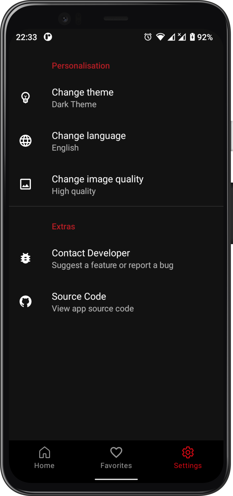
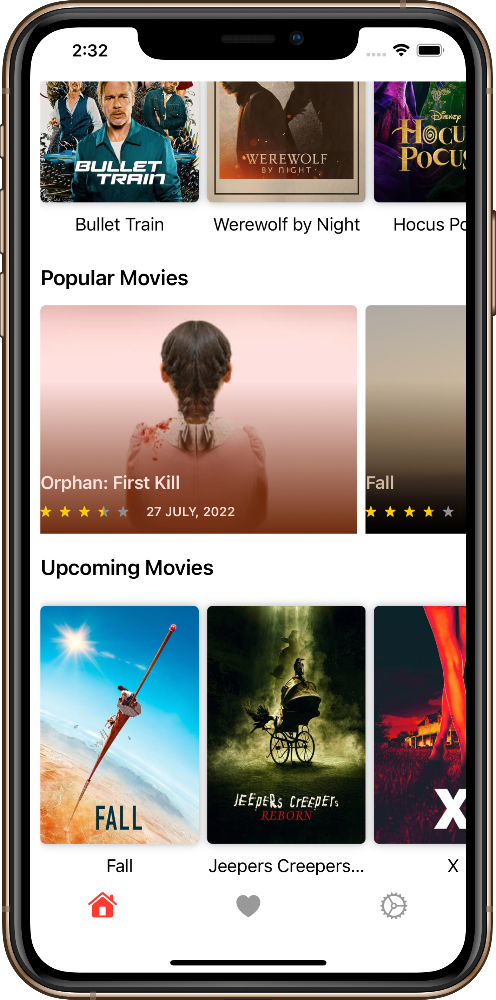
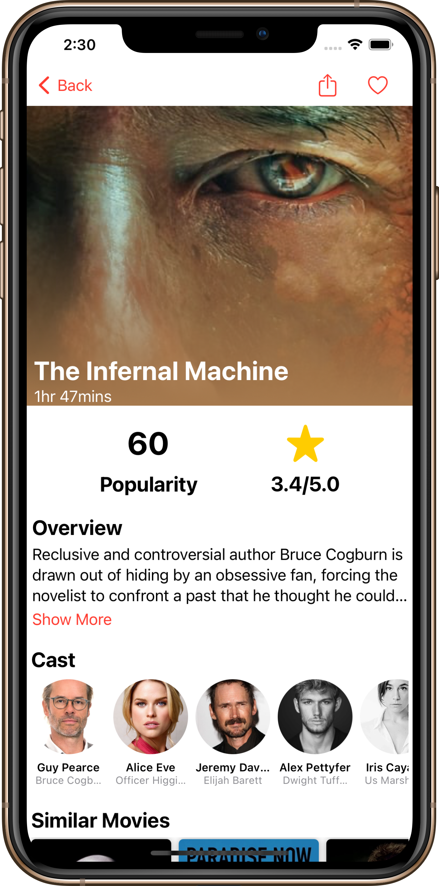
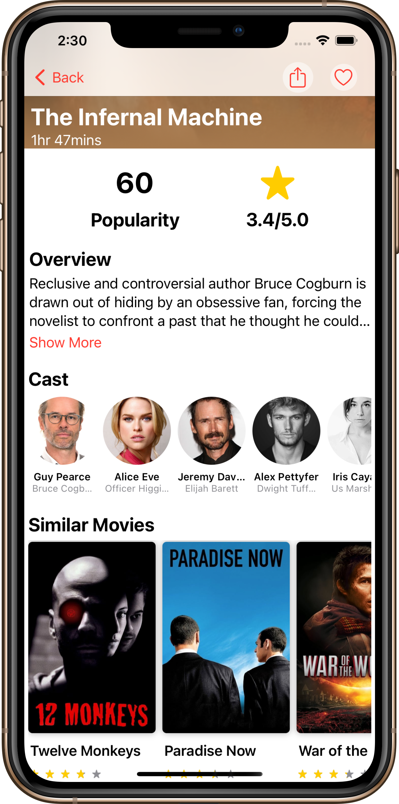
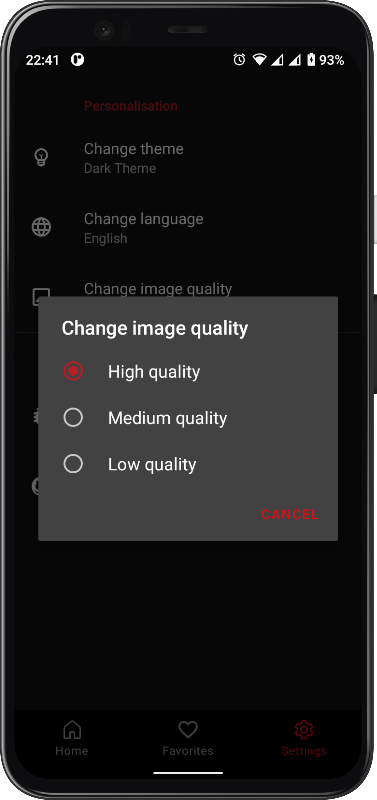

&nbsp;
&nbsp;
&nbsp;

# Notflix

# 🛠️Migrating to KMP - [Develop Branch](https://youtu.be/dQw4w9WgXcQ) 🛠

 An android and desktop app built using [Kotlin Multiplatforom](https://kotlinlang.org/docs/multiplatform.html) that consumes [TMDB API]("https://developers.themoviedb.org/3") to display current trending, upcoming and popular movies🍿 and tvshows🎬.

## Table Of Content

- [Prerequisite](#prerequisite)
  - [Disclaimer](##disclaimer)
- [App Structure](##app-structure)
- [Architecture](#architecture)
- [Libraries](##Libraries)
  - [Shared](###Shared)
  - [Android](###Android)
- [Extras](##Extras)
- [Demo](#demo)
  - [Android](##Android)
- [Related Resources](#related-resources)
- [Other Helpful Resources](#other_helpful_posts)
- [Work In Progress](#work-in-progress)

- [Related Resources](#Related-resources)
- [Other Helpful Resources](#Other-helpful-resources)

## Prerequisite

In order to be able to build the application you'll need to change the api key in [`gradle.properties`](link_to_gradle.properties_file). First and formost you need to generate your own api key by [creating](https://www.themoviedb.org/signup) a TMDB account and [generating](https://www.themoviedb.org/settings/api) an api key.

## App Structure

## Architecture

// ToDo :)

## Libraries

This project uses many of the popular libraries, plugins and tools of the android ecosystem.

## Libraries

### Shared

- [kotlinx.coroutines](https://github.com/Kotlin/kotlinx.coroutines) - Library support for Kotlin coroutines with multiplatform support.
- [Koin](https://insert-koin.io/docs/setup/v3.1) - Kotin dependency injection library with multiplatform support.
- [kotlinx.serialization](https://github.com/Kotlin/kotlinx.serialization) - Provides sets of libraries for various serialization formats eg. JSON, protocol buffers, CBOR etc.
- [Ktor](https://ktor.io/docs/http-client-multiplatform.html) - Provides multiplatform libraries required to make network calls to the REST API.
- [Realm](https://github.com/realm/realm-kotlin) - Caching of application data from network responses.
- [Multiplatform Settings](https://github.com/russhwolf/multiplatform-settings) - This is a Kotlin library for Multiplatform apps, so that common code can persist key-value data.
- [Napier](https://github.com/AAkira/Napier) -  Logger library for Kotlin Multiplatform.
- [Mockk](https://github.com/mockk/mockk) - Library for creating mocks for tests.

### Android

- [Jetpack Compose](https://developer.android.com/jetpack/compose?gclid=Cj0KCQiA95aRBhCsARIsAC2xvfwC4pw6JG3r8U_4zVVSzwfCSIMMM8MKPMGAOTRoMjpkfpimPVz1FwoaAqlUEALw_wcB&gclsrc=aw.ds) - Modern toolkit for building native UI.
- [Coil](https://coil-kt.github.io/coil/) - An image loading library for Android backed by kotlin coroutines.
- [Splash Screen API](https://developer.android.com/guide/topics/ui/splash-screen) - Splash screen API reduces boilerplate code required to create a splash screen.
- [Accompanist Navigation Animation](https://google.github.io/accompanist/navigation-animation/) - Add animation support when navigating between screens using Compose navigation component.
- [Lottie Compose](https://github.com/airbnb/lottie/blob/master/android-compose.md) - Supports loading Lottie animations using jetpack compose.

## Extras

### Plugins

- [GitHub Actions](https://github.com/VictorKabata/Notflix/actions) - GitHub actions is used in this project to check for syntax correctness using KtLint, execute the unit tests and generate a new package when pushing chanes to the main branch.
- [KtLint](https://github.com/pinterest/ktlint) - The project uses KtLint to check for syntax correctness.

## Related Resources

In this section i've included some resources ie. articles and GitHub reposirtories that i used to learn about Clean Architecture:

1. [The clean code blog](https://blog.cleancoder.com/uncle-bob/2012/08/13/the-clean-architecture.html) by Robert C. Martin.
2. [A detailed guide on developing android apps using clean architecture pattern](https://medium.com/@dmilicic/a-detailed-guide-on-developing-android-apps-using-the-clean-architecture-pattern-d38d71e94029) Medium article.
3. [Clean Architecture Component Boilerplater](https://github.com/bufferapp/clean-architecture-components-boilerplate) GitHub repo .
4. [The Force](https://github.com/odaridavid/Clean-MVVM-ArchComponents) GitHub repo by [David Odari](https://twitter.com/_davidodari) demonstrating using clean architecture pattern  
5. [Clean architecture tutorial for android](https://www.raywenderlich.com/3595916-clean-architecture-tutorial-for-android-getting-started) article by Raywenderlich which is really beginner friendly.
6. [Clean architecture in android](https://medium.com/swlh/clean-architecture-in-android-a-beginner-approach-be0ce00d806b) Medium article.
7. [Intro to app architecture](https://proandroiddev.com/intro-to-app-architecture-922b392b21b2) and [Intro to app modularization](https://proandroiddev.com/intro-to-app-modularization-42411e4c421e) articles by ProAndroidDev.

## Other Helpful Resources

In this section i've included resources that are not related to clean architecture but were really helpful in learning other android components and tools:

1. [Pokedex](https://github.com/ronnieotieno/PokeApi-Pokedex) GitHub repo by [Ronnie Otieno](https://twitter.com/ronnieonly) demonstrating how to use various jetpack components.
2. [Fundamentals of testing](https://developer.android.com/training/testing/fundamentals) from the official [android developers](https://developer.android.com/) site.
3. [Android MotionLayout Tutorial – Collapsing View](https://riggaroo.dev/android-motionlayout-tutorial-collapsing-view/) blog post on how to create a collapsing view with MotionLayout.
4. [MotionLayout – Collapsing Toolbar](https://blog.stylingandroid.com/motionlayout-collapsing-toolbar-part-1/) blog post demonstrating how to create a collapsing toolbar using MotionLayout
5. [Introduction to Github Actions for Android](https://blog.mindorks.com/github-actions-for-android) blog by [Mindorks](https://mindorks.com/) on how to set up GitHub actions for an android project.

## Demo

These are the app's screenshots:

  

  

    
