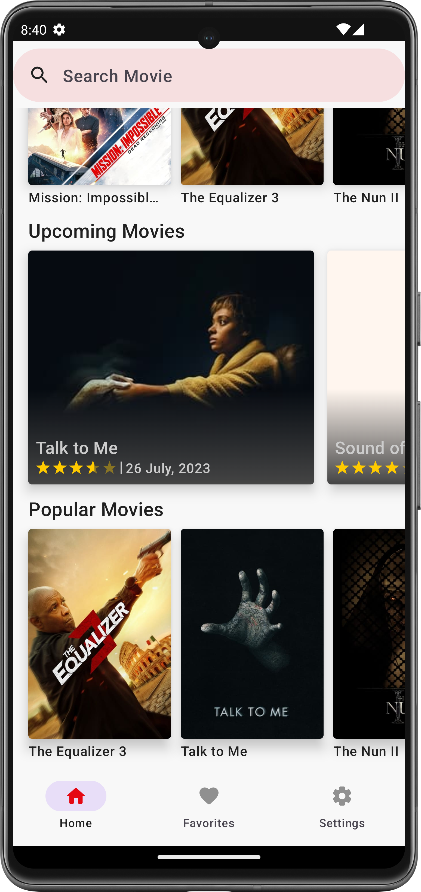
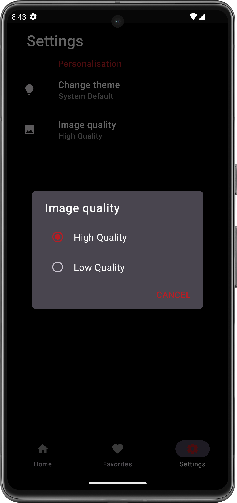
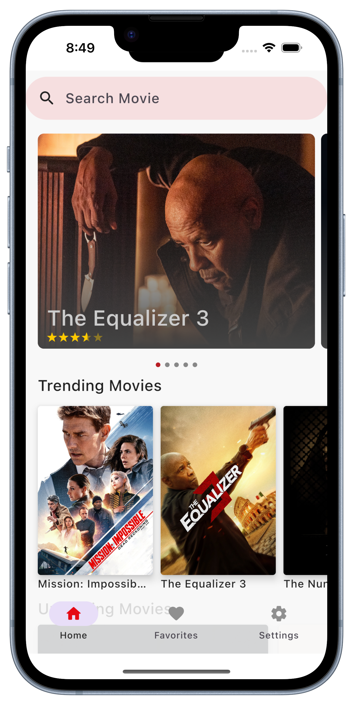
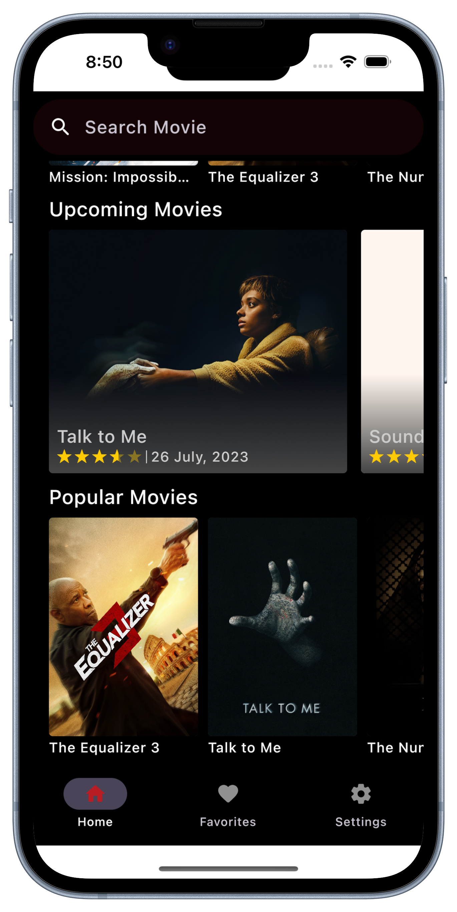
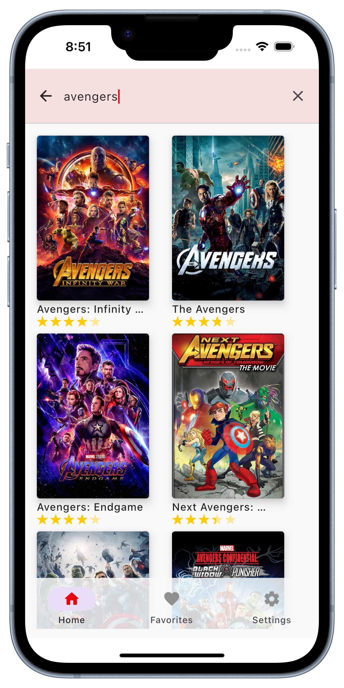

<p align="center"></p>

<p align="center">


</p>

# Notflix

# 🛠️Under constant refactor/development - [Develop Branch](https://youtu.be/dQw4w9WgXcQ)

An android and iOS app built using [Kotlin Multiplatforom](https://kotlinlang.org/docs/multiplatform.html) that consumes [TMDB API]("https://developers.themoviedb.org/3") to display current trending, upcoming and popular movies🍿 and tvshows🎬.

[Kotlin Multiplatform](https://kotlinlang.org/docs/multiplatform.html) is a framework of Kotlin that allows for sharing of a single codebase for business logic across different [targets](https://kotlinlang.org/docs/multiplatform-dsl-reference.html#targets)/platforms. Some of the targets supported by kotlin are: Android, iOS, Kotlin/JVM, Kotlin/JS, Android NDK, Windows, Linux, macOS etc.

[Compose Multiplatform](https://www.jetbrains.com/lp/compose-mpp/) is a UI framework maybe by Jetbrains that allow for simple and accelerated desktop application and web development using [compose](https://developer.android.com/jetpack/compose). Compose multiplatform also allows sharing compose UI code between diffrent platforms. eg android, iOS desktop(Windows, Linux, MacOS) and web.

## Table Of Content

- [Screenshots](##screenshots)
- [Prerequisite](##prerequisite)
- [Running](##running)
- [Libraries](##libraries)
  - [Shared](###shared)
  - [Android](###android)
- [Extras](##extras)
- [Related Resources](##related-resources)
  - [Videos 📽️](###videos-️)
  - [Articles/Blogs 📖](###articlesblogs-)
  - [Sample Projects 🤖](###sample-projects-)
- [Other Helpful Resources](##other-helpful-resources)
  - [Videos 📽️](###videos-️-1)
  - [Articles/Blogs 📖](###articlesblogs--1)
  - [Sample Projects 🤖](###sample-projects--1)

## Screenshots

## Android

    

## iOS

   

## Desktop

 

## Prerequisite

// ToDo

## Running

Set up the `local.properties` file in the project's root directory (if it doesn't already exist) by adding the following properties:

```properties
api_key=<YOUR TMDB API KEY>
```

Run with the following command:

```bash
./gradlew run
```

## Libraries

### Shared

- [Compose Multiplatform](https://github.com/JetBrains/compose-multiplatform) - Compose Multiplatform is a declarative framework for sharing UIs across multiple platforms with Kotlin based on Jetpack compose.
- [Koin](https://insert-koin.io/docs/setup/v3.1) - Kotin dependency injection library with multiplatform support.
- [Ktor](https://ktor.io/docs/http-client-multiplatform.html) - Provides multiplatform libraries required to make network calls to the REST API.
- [Multiplatform Settings](https://github.com/russhwolf/multiplatform-settings) - This is a Kotlin library for Multiplatform apps, so that common code can persist key-value data.
- [kotlinx.coroutines](https://github.com/Kotlin/kotlinx.coroutines) - Library support for Kotlin coroutines with multiplatform support.
- [kotlinx.serialization](https://github.com/Kotlin/kotlinx.serialization) - Provides sets of libraries for various serialization formats eg. JSON, protocol buffers, CBOR etc.
- [kotlinx.datetime](https://github.com/Kotlin/kotlinx-datetime) - A multiplatform Kotlin library for working with date and time.
- [Napier](https://github.com/AAkira/Napier) -  Logger library for Kotlin Multiplatform.
- [BuildKonfig](https://github.com/yshrsmz/BuildKonfig) - Supports embedding values from gradle file.
- [Image Loader](https://github.com/qdsfdhvh/compose-imageloader) - Compose Image library for Kotlin Multiplatform

## Related Resources

In this section I've included some resources ie. articles and GitHub repositories that i used to learn about kotlin multiplatform mobile:

### Videos 📽️

- [Your First Kotlin Multiplatform Mobile App Tutorial](https://www.youtube.com/watch?v=GcqFhoUuNNI)
- [Sharing Code between iOS and Android with Kotlin #1](https://www.youtube.com/watch?v=mdN6P6RI__k&t=13s)

### Articles/Blogs 📖

- [Kotlin Multiplatform Hands-on: Networking and Data Storage](https://play.kotlinlang.org/hands-on/Networking%20and%20Data%20Storage%20with%20Kotlin%20Multiplatfrom%20Mobile/01_Introduction)
- [KaMPKit General Architecture](https://github.com/touchlab/KaMPKit/blob/main/docs/GENERAL_ARCHITECTURE.md)
- [Using Koin in a Kotlin Multiplatform Project](https://johnoreilly.dev/posts/kotlinmultiplatform-koin/)
- [Create your first cross-platform mobile app – tutorial](https://kotlinlang.org/docs/multiplatform-mobile-create-first-app.html) - Learn how to create and run your first Kotlin Multiplatform Mobile application.
- [Kotlin Multiplatform. Very beginner’s guide (part 1-3)](https://medium.com/proandroiddev/kotlin-multiplatform-very-beginners-guide-part-1-6419f74afa0f)
- [Using Realm persistence library in a Kotlin Multiplatform project](https://johnoreilly.dev/posts/realm-kotlinmultiplatform/)

### Sample Projects 🤖

- [KMM Sample](https://github.com/KaterinaPetrova/kmm-sample) - A sample project for experiments with Kotlin Multiplatform mobile.
- [Fantasy Premier League](https://github.com/joreilly/FantasyPremierLeague) - Kotlin Multiplatform project with Jetpack Compose, Compose for Desktop and SwiftUI clients (and using Ktor for remote API requests and Realm for persistence).
- [KaMPKit](https://github.com/touchlab/KaMPKit)
- [People In Space](https://github.com/joreilly/PeopleInSpace) - Minimal Kotlin Multiplatform project with SwiftUI, Jetpack Compose, Compose for Wear OS, Compose for Desktop, Compose for Web, and Kotlin/JS + React clients along with Ktor backend.
- [Poetree](https://github.com/MamboBryan/poetree) - Poetree is a minimalistic poetry app that helps people freely access art from a global community full of poetry lovers.

## Other Helpful Resources

In this section I've included resources that are not related to kotlin multiplatform mobile but were really helpful in learning other android components and tools:

### Videos 📽️

- ToDo

### Articles/Blogs 📖

- [Introduction to Github Actions for Android](https://blog.mindorks.com/github-actions-for-android) blog by [Mindorks](https://mindorks.com/) on how to set up GitHub actions for an android project.

### Sample Projects 🤖
