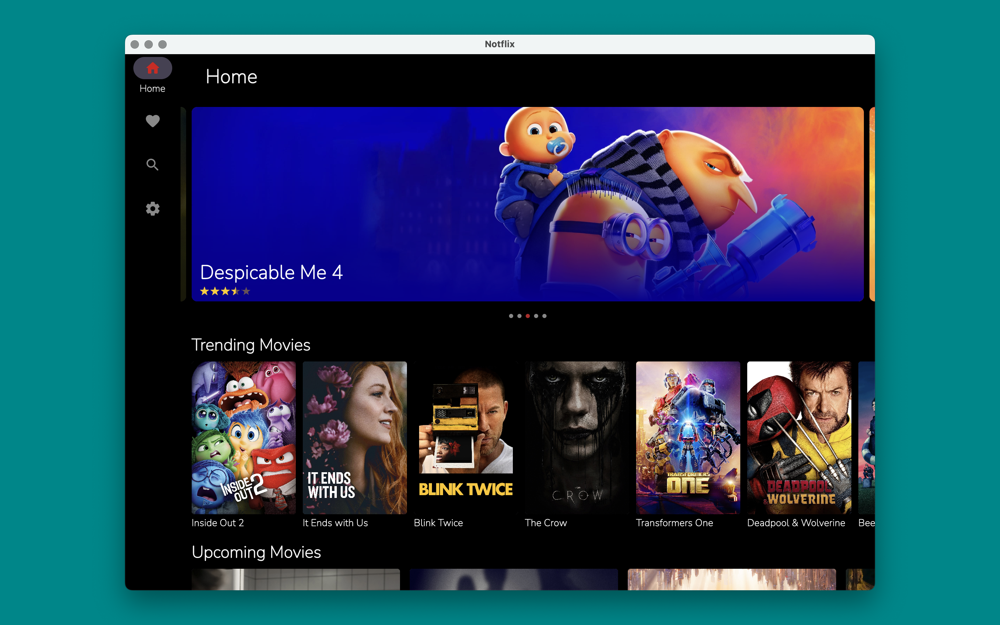

# Notflix

<!-- <p align="center"></p> -->

<p align="center">


</p>

Notflix is a [Kotlin Multiplatform]((https://kotlinlang.org/docs/multiplatform.html)) app that demonstrates cross-platform development using a single codebase and [Compose Multiplatform](https://www.jetbrains.com/lp/compose-mpp) for a consistent UI across Android, iOS and desktop(Linux, Windows & macOS) devices.

It consumes the TMDB API to fetch movie data and display it on all platforms.

> [!note]
This repository is under constant development/refactor since the project is designed to showcase the basics of Kotlin/Compose Multiplatform and is not intended for production use


## Table Of Content

- [Screenshots](##screenshots)
- [Getting Started](##getting-started)
  - [Prerequisite](###prerequisite)
  - [Installation](###installation)
- [Libraries](##libraries)
- [Related Resources](##related-resources)
  - [Videos 📽️](###videos-️)
  - [Articles/Blogs 📖](###articlesblogs-)
  - [Sample Projects 🤖](###sample-projects-)

## Screenshots

## Android

      

## iOS

      

## Desktop

 


## Getting Started

### Prerequisite

- [JDK](https://www.oracle.com/java/technologies/downloads/?er=221886) - Required for Android development.
- [Android Studio](https://developer.android.com/studio) - For Android development and project management.
- [Xcode](https://apps.apple.com/us/app/xcode/id497799835) - For iOS development and project management.
- [Kotlin Multiplatform Plugin](https://kotlinlang.org/docs/multiplatform-plugin-releases.html?_gl=1*130bj1*_gcl_au*MTk1MDYwOTc4MS4xNzIxNjMzNjAy*_ga*MTM4NzQwMTA3NS4xNjk3NDg5MzQ5*_ga_9J976DJZ68*MTcyMzExNTUwNy43Ni4xLjE3MjMxMTU1OTYuNDQuMC4w#release-details)- In Android Studio, select Settings/Preferences | Plugins, search Marketplace for Kotlin Multiplatform, and then install it.

### Installation
- Clone the repository from GitHub:
```bash
git clone https://github.com/VictorKabata/Notflix.git
```

To install the __android__ application:
- Open the project in Android Studio and connect your android device/emulator.
- Configure the TMDB API key in the `local.properties` file.
```properties
api_key=<YOUR TMDB API KEY>
```
- Sync the Gradle project to download dependencies.
- Run the gradle command below from Android Studio terminal to build and install the android application on the connected android device/emulator:
```bash
./gradlew installDebug
```

To install the __iOS__ application:
- Open the __iOS__ project from XCode and connect your iOS device/emulator.
- Run the project.

To install the __desktop__ application:
- Open the project in Android Studio and run the gradle command below to build and install the application on the desktop:
```bash
gradlew desktopRun
```

## Project Structure

The application has two main modules:
1. composeApp: This is the core module containing the shared Kotlin Multiplatform code for network, caching, and UI logic.
  - __androidMain__: Contains Android-specific code, primarily serving as an entry point for the Android application. This directory includes the MainActivity class, application-level configuration, and Android-specific dependencies or initialization.

  - __iOSMain__: Contains iOS-specific code, primarily serving as an entry point for the iOS application. This directory includes the ContentView class, application-level configuration, and iOS-specific initialization for Koin.

  - __desktopMain__: Contains desktop-specific code, primarily serving as an entry point for the desktop application. This directory includes the main application class, window creation, and desktop-specific dependencies or initialization.
  - __commonMain__: Contains the core business logic, data access, and UI components that are shared across all platforms.
    - __domain__: This package houses the domain layer, which defines the business logic and entities of the application. It typically includes interfaces, data classes, and utils.
    - __data__: This package houses the data layer, which is responsible for fetching and caching data. It might include repositories, data sources, and network clients.
    - __ui__: This package houses the UI components that are shared across all platforms. These components can be implemented using Compose Multiplatform, allowing for a consistent user experience.
    - __di__: Contains the dependency injection setup, managing the creation and provision of dependencies throughout the application.

2. appiOS:  This module houses the iOS-specific app code, serving as the entry point for the iOS application, providing the necessary configuration and integration with the shared _composeApp_ module.

## Libraries

- [Kotlin Multiplatform](https://kotlinlang.org/docs/multiplatform.html) - The foundation of the project, enabling shared code across platforms.
- [Compose Multiplatform](https://github.com/JetBrains/compose-multiplatform) - Enables building consistent UI components for Android, iOS, and desktop.
- [KotlinX  Coroutines](https://github.com/Kotlin/kotlinx.coroutines) - Manages asynchronous operations for efficient app performance.
- [Datastore](https://developer.android.com/kotlin/multiplatform/datastore) - Provides a mechanism for storing and retrieving key value pairs like user preferences.
- [Koin](https://insert-koin.io/) - A dependency injection framework for managing dependencies throughout the application.
- [kotlinx.serialization]() - Enables serialization and deserialization of data objects.
- [Ktor](https://ktor.io/docs/client-create-and-configure.html) - A multiplatform HTTP client for making network requests and handling responses.
- [Napier](https://github.com/AAkira/Napier) - A logging library for providing detailed logs during development.
- [kotlinx.datetime](https://github.com/Kotlin/kotlinx-datetime) - A multiplatform Kotlin library for working with date and time.
- [Room](https://developer.android.com/kotlin/multiplatform/room) - Provides a persistence layer for storing data locally.
- [Paging](https://github.com/cashapp/multiplatform-paging) - Enables efficient handling of large datasets for pagination in UI components.
- [BuildKonfig](https://github.com/yshrsmz/BuildKonfig) - Supports embedding values from gradle file.
- [Coil3](https://github.com/qdsfdhvh/compose-imageloader) - Compose Image library for Kotlin Multiplatform
- [Jetpack Navigation](https://www.jetbrains.com/help/kotlin-multiplatform-dev/compose-navigation-routing.html) - Provides navigation components for handling UI transitions within the app.
- [KMP Palette](https://github.com/jordond/kmpalette) - Provides tools for working with colors on multiple platforms.
- [Ktlint](https://github.com/pinterest/ktlint): For enforcing code style consistency.
- [Detekt](https://github.com/detekt/detekt): For static code analysis and quality checks.

## Related Resources

In this section I've included some resources ie. articles and GitHub repositories that i used to learn about kotlin multiplatform:

### Videos 📽️

- [Your First Kotlin Multiplatform Mobile App Tutorial](https://www.youtube.com/watch?v=GcqFhoUuNNI)
- [Sharing Code between iOS and Android with Kotlin #1](https://www.youtube.com/watch?v=mdN6P6RI__k&t=13s)

### Articles/Blogs 📖

- [Kotlin Multiplatform Hands-on: Networking and Data Storage](https://play.kotlinlang.org/hands-on/Networking%20and%20Data%20Storage%20with%20Kotlin%20Multiplatfrom%20Mobile/01_Introduction)
- [KaMPKit General Architecture](https://github.com/touchlab/KaMPKit/blob/main/docs/GENERAL_ARCHITECTURE.md)
- [Using Koin in a Kotlin Multiplatform Project](https://johnoreilly.dev/posts/kotlinmultiplatform-koin/)
- [Create your first cross-platform mobile app – tutorial](https://kotlinlang.org/docs/multiplatform-mobile-create-first-app.html) - Learn how to create and run your first Kotlin Multiplatform Mobile application.
- [Kotlin Multiplatform. Very beginner’s guide (part 1-3)](https://medium.com/proandroiddev/kotlin-multiplatform-very-beginners-guide-part-1-6419f74afa0f)
- [Using Realm persistence library in a Kotlin Multiplatform project](https://johnoreilly.dev/posts/realm-kotlinmultiplatform/)

### Sample Projects 🤖

- [KMM Sample](https://github.com/KaterinaPetrova/kmm-sample) - A sample project for experiments with Kotlin Multiplatform mobile.
- [Fantasy Premier League](https://github.com/joreilly/FantasyPremierLeague) - Kotlin Multiplatform project with Jetpack Compose, Compose for Desktop and SwiftUI clients (and using Ktor for remote API requests and Realm for persistence).
- [KaMPKit](https://github.com/touchlab/KaMPKit)
- [People In Space](https://github.com/joreilly/PeopleInSpace) - Minimal Kotlin Multiplatform project with SwiftUI, Jetpack Compose, Compose for Wear OS, Compose for Desktop, Compose for Web, and Kotlin/JS + React clients along with Ktor backend.
- [Poetree](https://github.com/MamboBryan/poetree) - Poetree is a minimalistic poetry app that helps people freely access art from a global community full of poetry lovers.
